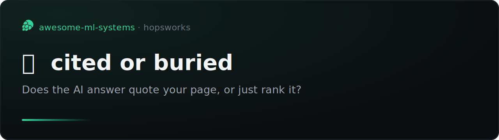
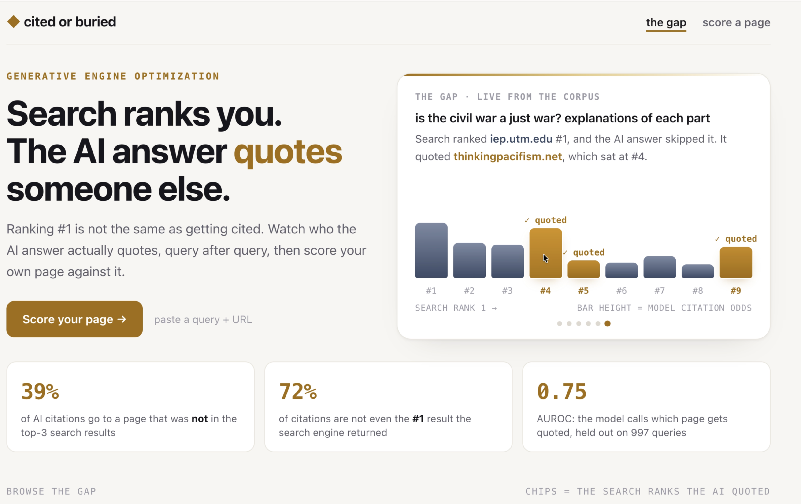
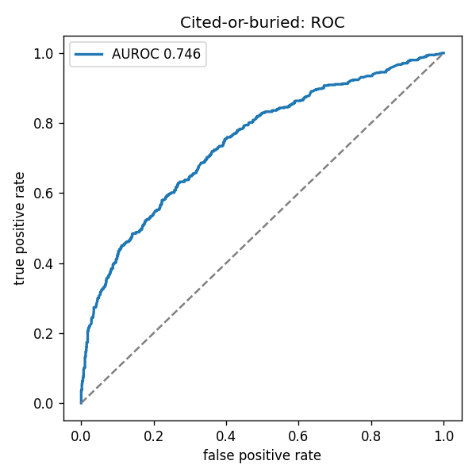
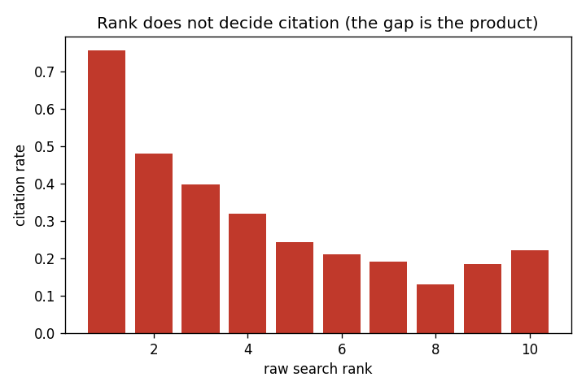
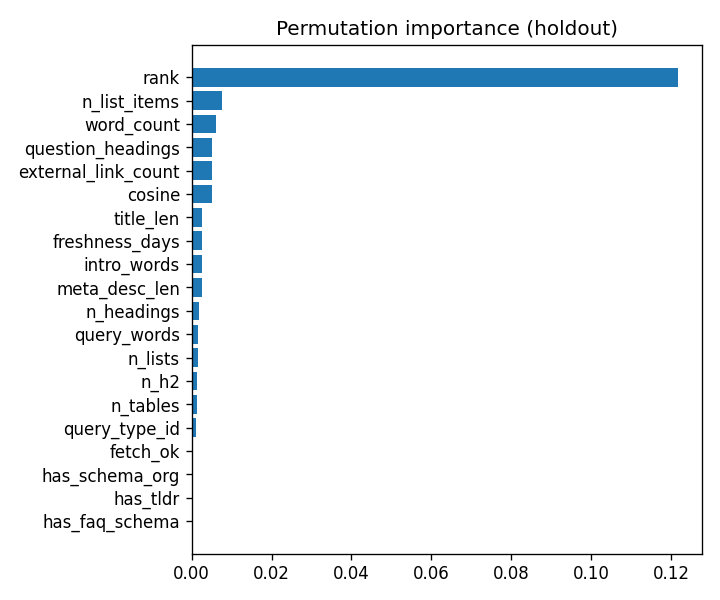

# cited or buried



[](https://github.com/MagicLex/awesome-ml-systems#the-dog-house)
[](https://www.hopsworks.ai/)

> **Doghouse project.** The data tells a real story: 40% of AI citations go to a
> page that was not in the top-3 search results, and rank correlates with citation
> only -0.36. But that gap belongs to the answer engine, not to the model. Over raw
> search rank the model adds almost nothing: pointwise AUROC 0.746 vs 0.721, and
> precision@3 +0.003 (rank already saturates the top). So the coach cannot tell you
> much beyond where you already rank. Full post-mortem in the
> [awesome-ml-systems dog house](https://github.com/MagicLex/awesome-ml-systems#the-dog-house).
> Kept public, the corpus is a clean GEO dataset. Fork it if you can do better.

Search ranks your page. The AI answer quotes someone else. `cited or buried`
predicts which one you are: given a search query and a page, it scores the
chance a grounded AI answer will cite that page, and names the structural
levers that move it. One row is one (query, page) pair; the label is whether
the answer engine actually quoted it. A ranker over search results, with a live
page-scoring coach on top.

Citation is a directional GEO signal from one answer engine, not a Google-AIO
oracle.



## The result

`cited_ranker` v2, a gradient-boosted classifier over 997 informational queries
and 8,052 (query, page) pairs sampled from MS MARCO. Features are the raw search
rank, the page's structure (where the answer sits, headings, lists, tables,
schema.org markup, freshness) and the query/page semantic match. Held out by
query id: 200 queries, 1,614 pairs the model never saw.

| pointwise "will this page be cited" | AUROC | AP |
|---|---:|---:|
| **cited_ranker v2 (rank + page structure + semantics)** | **0.746** | **0.638** |
| rank alone | 0.721 | n/a |

| reorder the top-3 (precision@3) | model | rank alone | lift |
|---|---:|---:|---:|
| precision@3 | 0.552 | 0.549 | +0.003 |
| ndcg@3 | 0.664 | 0.658 | +0.006 |

Three honest readings:

- **The gap is real: 40% of AI citations go to a page that wasn't even in the
  top-3 search results** (72% aren't the #1 result; the median cited page ranks
  #3). Rank correlates with citation only -0.36. The answer engine reaches past
  the top of the page.
- **Page structure adds a small but real edge over rank.** Pointwise, reading
  the page lifts AUROC from 0.721 (rank alone) to 0.746, a +2.5 point gain from
  schema markup, answer-up-top, lists and freshness. It is not a blowout. It is
  a genuine, actionable nudge.
- **Reordering the top-3 is dead** (+0.003 precision@3). Search rank already
  saturates the very top of the page (hit@3 0.92), so there is nothing to win by
  shuffling the first three. The value is pointwise: knowing which specific page
  earns the quote, which is exactly what the coach answers.





## The app

Two views, server-rendered (no SPA), light theme.

- **the gap**: a rotating showcase cycles real queries as a bar chart, one bar
  per search result in rank order, height is the model's citation odds, gold bar
  and a tick for the pages the AI actually quoted. Open any query for the full
  split: the raw search order on the left, what the AI quoted on the right with
  each source's search-rank badge and plain-word reasons.
- **score a page**: paste a query and a URL. The `citedscorer` KServe
  deployment fetches the page live, reads its structure and topic match, and
  returns the citation odds on a ring dial with the levers that moved it (answer
  up top, schema markup, freshness, structure). No web search: your page against
  the query.

## Architecture (FTI on Hopsworks)

```
F1  capture_serp     fleet labels (query, url, rank, cited)  -> serp_capture FG
F2  fetch_pages      live fetch + structural MITs + embedding -> page_features FG
                     query type + embedding                   -> query_features FG
    build_fv         serp x page x query, label = cited       -> cited_fv
T1  train_ranker     GroupShuffleSplit by query, HGB, evals    -> cited_ranker (registry)
I1  score_corpus     batch score the corpus                    -> geo_scored FG (gallery)
    predictor        {query, urls} -> live fetch + score       -> citedscorer (KServe)
    server           gallery + coach                           -> citedorburied (app)
```

`cited_features.py` is the one no-skew module: the same `feature_row()` builds
the model input in the trainer, the batch scorer and the live predictor, so
training and serving cannot drift.

## Caveats

- **Labels are one answer engine's behavior**, captured by a fleet, not a
  Google-AIO oracle. Read the score as a directional GEO signal, not ground
  truth about any single product.
- **The coach scores one page, not the web.** With no SERP key at serving, it
  answers "would the answer for this query cite this page", not "who wins this
  query". Rank is supplied as the page's known search position.
- **Structure is parsed from raw HTML** with the stdlib. JS-only pages fetch
  empty and score on rank alone (fetch_ok = 0); the model imputes the rest.
- **MS MARCO informational queries**, seed 13. The corpus is what we sampled;
  its topic mix sets the model's world.

## Run it

```
python make_batch.py --start 0 --end 1000 --out capture_workflow.js   # F1 fleet script
python capture_serp.py                                                # F1 -> serp_capture
python deploy_fetch.py && hops job run fetch-pages                    # F2 -> page/query FGs
python build_fv.py                                                    # feature view
python deploy_train.py && hops job run train-ranker                   # T1 -> registry
python score_corpus.py                                                # I1 -> geo_scored
python deploy_serving.py                                              # I1 -> citedscorer
python app/deploy_app.py                                              # app
```

Built on [Hopsworks](https://www.hopsworks.ai/). A
[dog-house](https://github.com/MagicLex/awesome-ml-systems#the-dog-house) entry in
[awesome-ml-systems](https://github.com/MagicLex/awesome-ml-systems).
